This file is generated by `scripts/timings_enum_measure.py`.
The benchmark first writes `docs/timings-enum.tsv`, then renders this
Markdown page and timing plots from that TSV.

Example timings from the opt-in performance benchmark, measured in release mode
on one development machine. Treat them as indicative, not as a portability,
stability, or universality guarantee.

## Benchmark environment

| Field | Value |
| --- | --- |
| Recorded | 2026-06-03 16:36 UTC |
| Runtime | Python 3.12.13, RDKit 2026.03.1 |
| Platform | Linux-6.17.0-23-generic-x86_64-with-glibc2.36 |
| CPU | AMD Ryzen 5 7640U w/ Radeon 760M Graphics; 12 logical CPUs visible |
| Memory limit | 2 GiB |
| Container | `compose/timings-enum.yml` `timings-enum` service, network disabled |

- This is a small curated benchmark: 9 molecules, 2 writer modes, and
  7 timing repeats per row.
- This is not a workload study and not an exact-versus-exact comparison.
- `Support`: the size of the exact rooted SMILES support across all root atoms.
- `Grimace enum (per-root union)`: union of
  `MolToSmilesEnum(..., rootedAtAtom=root_idx, canonical=False, doRandom=True, isomericSmiles=<table mode>)`
  over every root atom.
- The direct public `MolToSmilesEnum(..., rootedAtAtom=-1, ...)` path is
  not timed in this column and can differ materially from the explicit
  per-root union shown here.
- `Decoder enum (branch-preserving, per-root)`: exhaustive traversal of
  `MolToSmilesDecoder(..., rootedAtAtom=root_idx, canonical=False, doRandom=True, isomericSmiles=<table mode>).next_choices`
  over every root atom, then unioned.
- `Decoder enum (determinized, per-root)`: the same per-root traversal,
  using `MolToSmilesDeterminizedDecoder(...)`.
- `Decoder enum (branch-preserving, merged)`: exhaustive traversal of
  `MolToSmilesDecoder(..., rootedAtAtom=-1, canonical=False, doRandom=True, isomericSmiles=<table mode>).next_choices`.
- `Decoder enum (determinized, merged)`: the same merged traversal,
  using `MolToSmilesDeterminizedDecoder(...)`.
- `RDKit to 1/2 support`: repeated RDKit `MolToSmiles(..., canonical=False,
  doRandom=True, rootedAtAtom=root_idx, isomericSmiles=<table mode>)` draws
  across all roots until half of the exact support has been seen.
- `RDKit to full support`: the same sampling process until the full exact
  support has been seen.
- `Non-stereo` means `isomericSmiles=False`.
- `Stereo` means `isomericSmiles=True`.
- All timing columns are shown as `time mean ± std`.
- The two RDKit columns also show `(draw mean ± std)` over repeated seeded
  trials.
- The published table does not directly rank every public exact path:
  it times `Grimace enum (per-root union)` rather than the direct
  public `MolToSmilesEnum(..., rootedAtAtom=-1)` path, and some
  merged decoder rows are numerically lower than that per-root
  union column.
- The merged decoder rows expose the public all-roots decoder path directly,
  so they can diverge substantially from the explicit per-root rows.
- Decoder rows measure exhaustive traversal of complete support. They do
  not measure initialization alone or one selected generation/validation
  trajectory.
- Read the RDKit comparison as 'faster on this benchmark against this
  sampling baseline', not as a general claim about every molecule or
  every SMILES-writing workload.
- The determinized decoder can reduce exhaustive decoder cost on some
  molecules, but direct exact enumeration is still faster on these cases.

## Non-stereo (`isomericSmiles=False`)

{: .timings-table}
| Molecule | Atoms | Support | Grimace enum (per-root union) | Decoder enum (branch-preserving, per-root) | Decoder enum (determinized, per-root) | Decoder enum (branch-preserving, merged) | Decoder enum (determinized, merged) | RDKit to 1/2 support | RDKit to full support |
| --- | ---: | ---: | ---: | ---: | ---: | ---: | ---: | --- | --- |
| `CC(=O)Oc1ccccc1C(=O)O` | 13 | 304 | **12.2** ± 0.9 ms | **35.9** ± 2.9 ms | **38.0** ± 2.1 ms | **23.4** ± 2.8 ms | **19.9** ± 0.8 ms | **5.2** ± 0.4 ms (230.0 ± 18.8 draws) | **67.7** ± 19.8 ms (3086.7 ± 921.8 draws) |
| `C1CC2(CCO1)CO2` | 8 | 36 | **5.0** ± 0.3 ms | **9.4** ± 0.5 ms | **7.6** ± 0.1 ms | **4.2** ± 0.5 ms | **2.9** ± 0.0 ms | **0.3** ± 0.0 ms (23.0 ± 1.8 draws) | **2.2** ± 0.5 ms (155.6 ± 35.8 draws) |
| `CN1CCC[C@H]1c1cccnc1` | 12 | 136 | **9.3** ± 0.5 ms | **19.7** ± 1.0 ms | **19.9** ± 0.4 ms | **9.6** ± 0.3 ms | **8.5** ± 0.3 ms | **2.2** ± 0.2 ms (97.4 ± 8.7 draws) | **26.6** ± 3.6 ms (987.9 ± 169.9 draws) |
| `CNC(=O)O/N=C(\C)SC` | 10 | 72 | **7.5** ± 0.8 ms | **12.5** ± 1.0 ms | **10.9** ± 1.0 ms | **4.6** ± 0.6 ms | **4.3** ± 0.0 ms | **0.7** ± 0.0 ms (44.1 ± 2.5 draws) | **7.8** ± 2.0 ms (483.0 ± 122.3 draws) |
| `N[C@@H](Cc1ccc(O)c(O)c1)C(=O)O` | 14 | 688 | **15.2** ± 0.6 ms | **56.3** ± 9.9 ms | **54.0** ± 4.0 ms | **37.5** ± 3.2 ms | **42.2** ± 1.9 ms | **12.2** ± 0.5 ms (514.3 ± 12.9 draws) | **181.4** ± 57.1 ms (7946.7 ± 2448.6 draws) |
| `COc1ccc2cc([C@H](C)C(=O)O)ccc2c1` | 17 | 1504 | **20.7** ± 0.6 ms | **125.8** ± 6.8 ms | **138.9** ± 20.4 ms | **93.4** ± 5.9 ms | **93.5** ± 3.9 ms | **32.3** ± 1.6 ms (1143.0 ± 34.0 draws) | **740.7** ± 162.8 ms (24406.3 ± 4916.2 draws) |
| `O=[N+]([O-])O[C@H]1CO[C@H]2[C@@H]1OC[C@H]2O[N+](=O)[O-]` | 16 | 620 | **21.5** ± 2.3 ms | **116.0** ± 7.0 ms | **118.7** ± 7.2 ms | **74.5** ± 4.1 ms | **53.2** ± 4.5 ms | **18.4** ± 1.5 ms (492.6 ± 14.2 draws) | **310.5** ± 88.3 ms (7245.7 ± 2133.7 draws) |
| `C=C1CC[C@H](O)C/C1=C/C=C1\CCC[C@]2(C)[C@@H]([CH]C)CC[C@@H]12` | 22 | 5548 | **71.3** ± 34.7 ms | **517.9** ± 31.9 ms | **534.7** ± 20.0 ms | **384.4** ± 23.9 ms | **379.2** ± 12.6 ms | **177.5** ± 5.2 ms (4681.4 ± 66.1 draws) | **5521.4** ± 968.7 ms (128516.4 ± 19796.2 draws) |
| `CC1=C(CC(=O)O)c2cc(F)ccc2/C1=C\c1ccc(S(C)=O)cc1` | 25 | 12096 | **91.9** ± 7.3 ms | **2433.2** ± 191.5 ms | **1473.6** ± 21.3 ms | **1516.0** ± 85.2 ms | **982.3** ± 87.7 ms | **501.3** ± 73.3 ms (9630.1 ± 75.3 draws) | **14037.4** ± 3154.5 ms (261894.6 ± 39129.7 draws) |

<figure class="timing-plot">
  <figcaption><code>CC(=O)Oc1ccccc1C(=O)O</code>:</figcaption>
  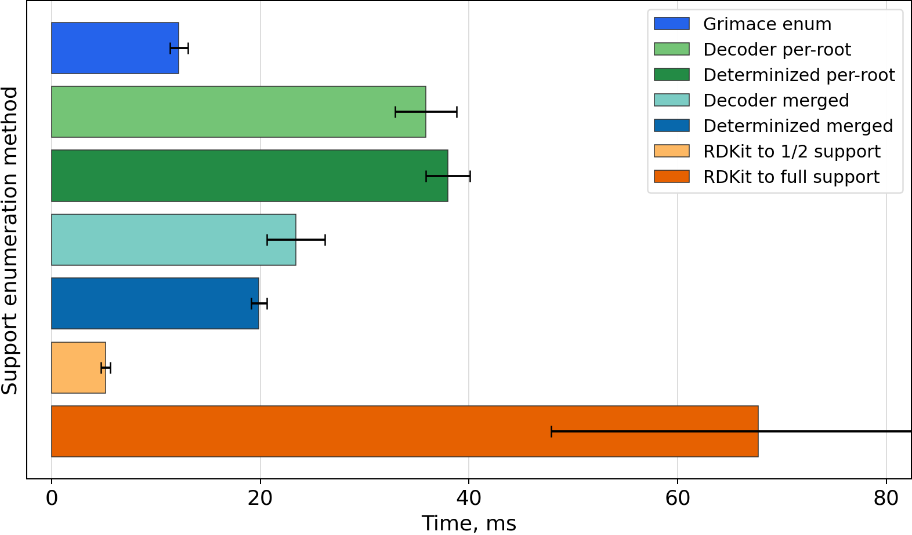
</figure>

<figure class="timing-plot">
  <figcaption><code>C1CC2(CCO1)CO2</code>:</figcaption>
  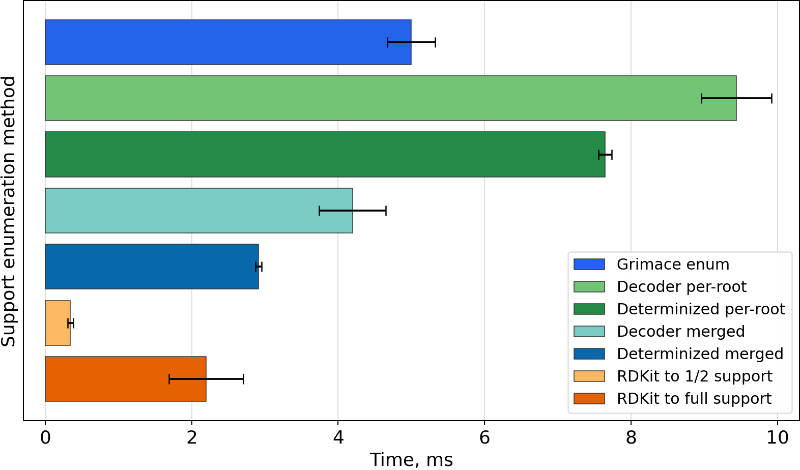
</figure>

<figure class="timing-plot">
  <figcaption><code>CN1CCC[C@H]1c1cccnc1</code>:</figcaption>
  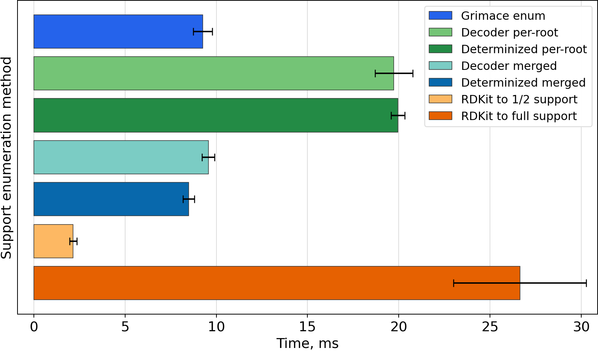
</figure>

<figure class="timing-plot">
  <figcaption><code>CNC(=O)O/N=C(\C)SC</code>:</figcaption>
  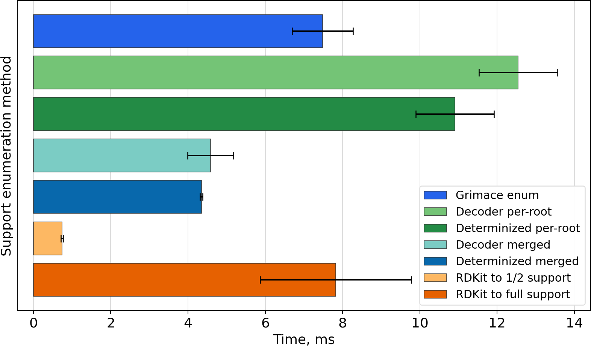
</figure>

<figure class="timing-plot">
  <figcaption><code>N[C@@H](Cc1ccc(O)c(O)c1)C(=O)O</code>:</figcaption>
  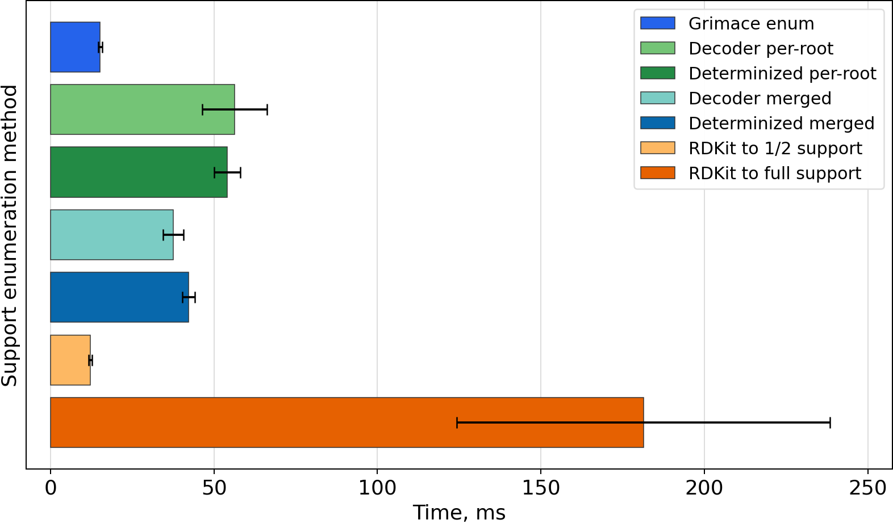
</figure>

<figure class="timing-plot">
  <figcaption><code>COc1ccc2cc([C@H](C)C(=O)O)ccc2c1</code>:</figcaption>
  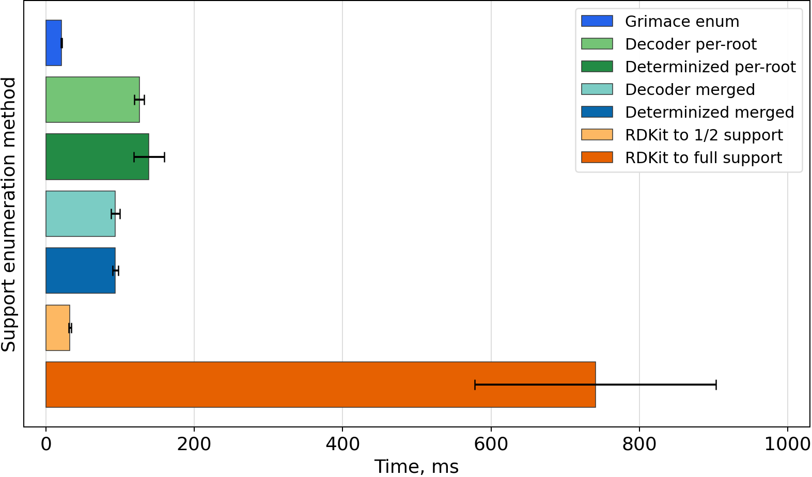
</figure>

<figure class="timing-plot">
  <figcaption><code>O=[N+]([O-])O[C@H]1CO[C@H]2[C@@H]1OC[C@H]2O[N+](=O)[O-]</code>:</figcaption>
  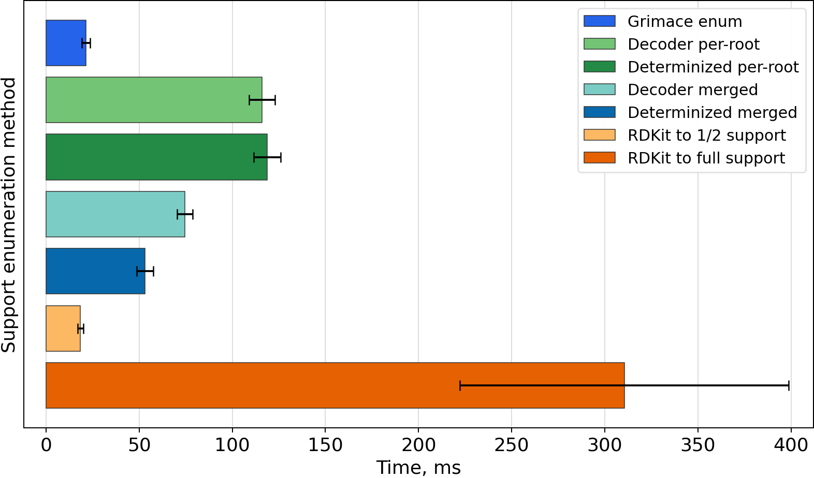
</figure>

<figure class="timing-plot">
  <figcaption><code>C=C1CC[C@H](O)C/C1=C/C=C1\CCC[C@]2(C)[C@@H]([CH]C)CC[C@@H]12</code>:</figcaption>
  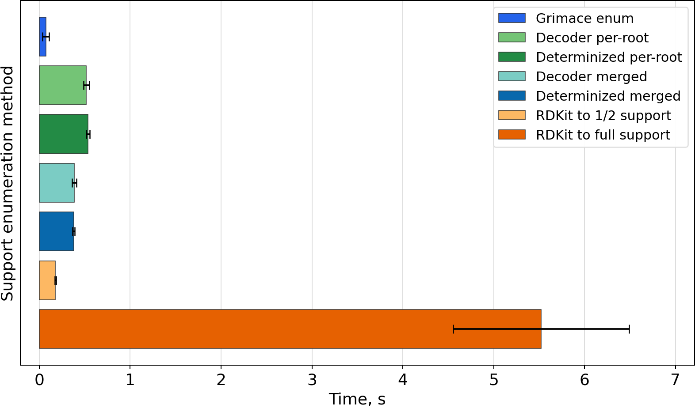
</figure>

<figure class="timing-plot">
  <figcaption><code>CC1=C(CC(=O)O)c2cc(F)ccc2/C1=C\c1ccc(S(C)=O)cc1</code>:</figcaption>
  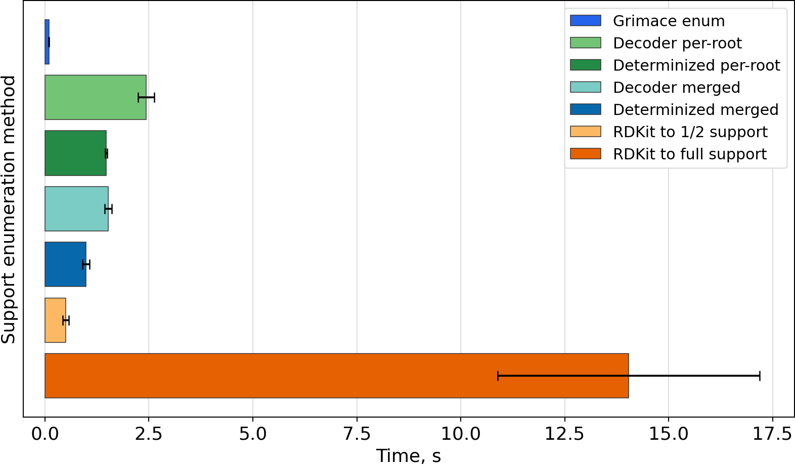
</figure>

## Stereo (`isomericSmiles=True`)

{: .timings-table}
| Molecule | Atoms | Support | Grimace enum (per-root union) | Decoder enum (branch-preserving, per-root) | Decoder enum (determinized, per-root) | Decoder enum (branch-preserving, merged) | Decoder enum (determinized, merged) | RDKit to 1/2 support | RDKit to full support |
| --- | ---: | ---: | ---: | ---: | ---: | ---: | ---: | --- | --- |
| `CC(=O)Oc1ccccc1C(=O)O` | 13 | 304 | **15.0** ± 1.0 ms | **38.6** ± 2.0 ms | **39.0** ± 2.6 ms | **23.5** ± 1.1 ms | **21.6** ± 0.8 ms | **5.8** ± 0.5 ms (222.6 ± 3.8 draws) | **80.2** ± 17.7 ms (3128.4 ± 683.9 draws) |
| `C1CC2(CCO1)CO2` | 8 | 36 | **6.4** ± 0.7 ms | **11.6** ± 0.7 ms | **10.1** ± 0.5 ms | **6.3** ± 0.5 ms | **5.1** ± 0.5 ms | **0.5** ± 0.3 ms (23.4 ± 2.1 draws) | **2.8** ± 0.5 ms (192.7 ± 37.6 draws) |
| `CN1CCC[C@H]1c1cccnc1` | 12 | 136 | **12.9** ± 0.5 ms | **23.9** ± 2.1 ms | **24.6** ± 1.9 ms | **12.0** ± 0.9 ms | **12.0** ± 0.7 ms | **2.3** ± 0.5 ms (93.1 ± 5.5 draws) | **23.0** ± 4.9 ms (986.9 ± 195.7 draws) |
| `CNC(=O)O/N=C(\C)SC` | 10 | 72 | **8.9** ± 0.5 ms | **33.0** ± 2.2 ms | **44.5** ± 3.3 ms | **34.7** ± 1.0 ms | **30.0** ± 2.0 ms | **0.9** ± 0.2 ms (51.3 ± 6.1 draws) | **7.5** ± 1.5 ms (411.0 ± 78.5 draws) |
| `N[C@@H](Cc1ccc(O)c(O)c1)C(=O)O` | 14 | 688 | **21.7** ± 0.8 ms | **139.7** ± 36.3 ms | **140.1** ± 39.7 ms | **70.5** ± 23.3 ms | **51.4** ± 1.5 ms | **13.7** ± 0.7 ms (514.6 ± 20.6 draws) | **219.7** ± 50.6 ms (7024.4 ± 654.9 draws) |
| `COc1ccc2cc([C@H](C)C(=O)O)ccc2c1` | 17 | 1504 | **39.9** ± 6.2 ms | **180.2** ± 13.7 ms | **180.0** ± 5.6 ms | **133.0** ± 12.3 ms | **129.0** ± 8.4 ms | **41.9** ± 5.6 ms (1160.9 ± 44.3 draws) | **704.4** ± 100.4 ms (20279.3 ± 3306.9 draws) |
| `O=[N+]([O-])O[C@H]1CO[C@H]2[C@@H]1OC[C@H]2O[N+](=O)[O-]` | 16 | 1240 | **35.6** ± 2.1 ms | **144.7** ± 18.4 ms | **125.5** ± 18.9 ms | **91.6** ± 4.3 ms | **86.7** ± 3.1 ms | **35.9** ± 5.3 ms (983.9 ± 28.0 draws) | **517.1** ± 103.9 ms (18416.3 ± 2617.4 draws) |
| `C=C1CC[C@H](O)C/C1=C/C=C1\CCC[C@]2(C)[C@@H]([CH]C)CC[C@@H]12` | 22 | 5548 | **185.6** ± 16.0 ms | **4001.0** ± 108.7 ms | **3852.3** ± 315.4 ms | **3148.1** ± 120.2 ms | **3357.4** ± 114.5 ms | **186.5** ± 24.8 ms (4709.1 ± 35.5 draws) | **5856.9** ± 912.9 ms (148845.6 ± 23587.3 draws) |
| `CC1=C(CC(=O)O)c2cc(F)ccc2/C1=C\c1ccc(S(C)=O)cc1` | 25 | 12096 | **339.3** ± 13.4 ms | **11169.7** ± 817.2 ms | **8514.0** ± 230.1 ms | **10094.1** ± 707.6 ms | **8415.8** ± 562.6 ms | **351.8** ± 24.1 ms (9570.0 ± 78.4 draws) | **10203.9** ± 1194.4 ms (269236.4 ± 30102.1 draws) |

<figure class="timing-plot">
  <figcaption><code>CC(=O)Oc1ccccc1C(=O)O</code>:</figcaption>
  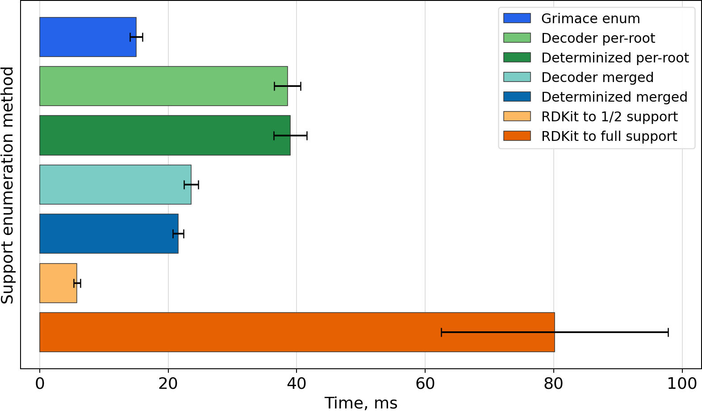
</figure>

<figure class="timing-plot">
  <figcaption><code>C1CC2(CCO1)CO2</code>:</figcaption>
  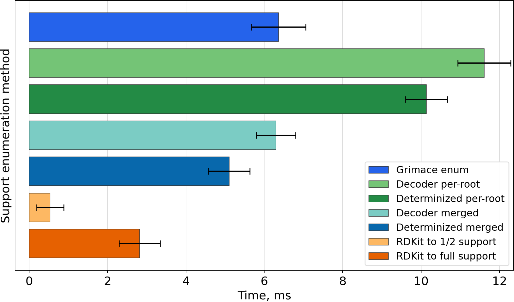
</figure>

<figure class="timing-plot">
  <figcaption><code>CN1CCC[C@H]1c1cccnc1</code>:</figcaption>
  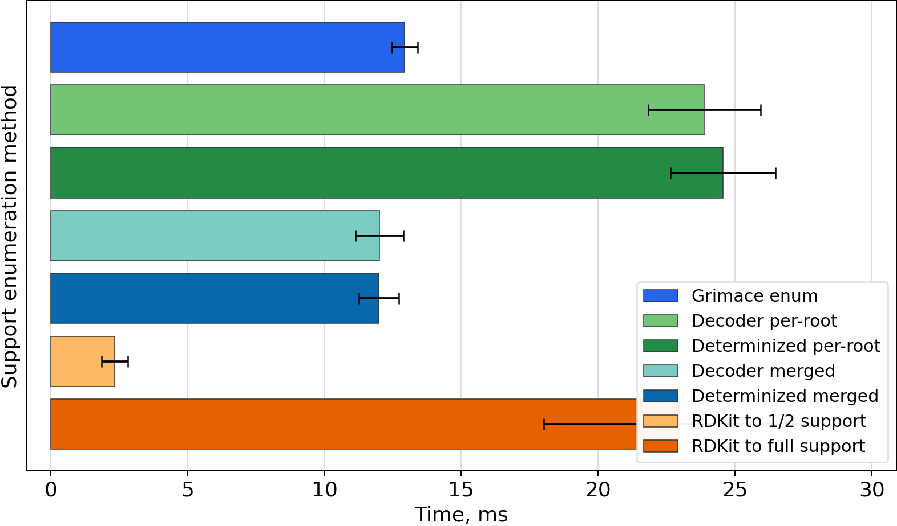
</figure>

<figure class="timing-plot">
  <figcaption><code>CNC(=O)O/N=C(\C)SC</code>:</figcaption>
  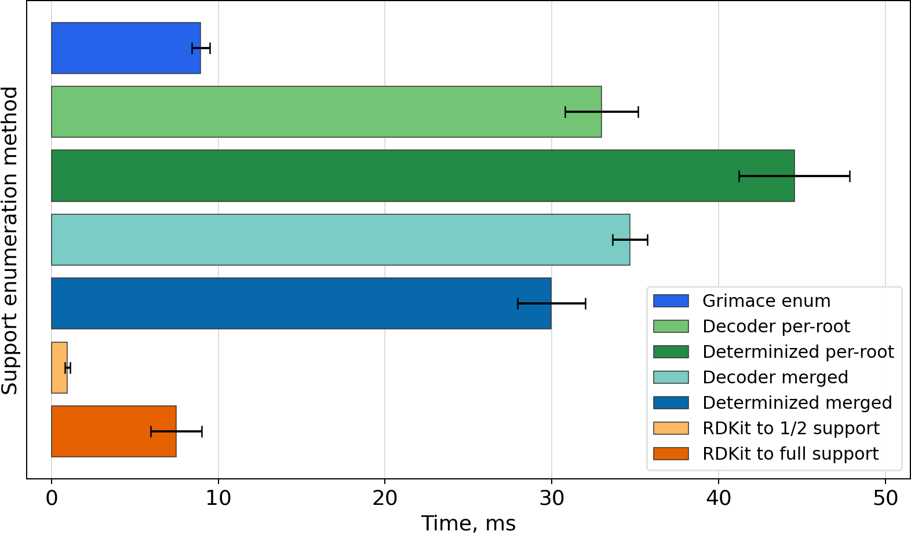
</figure>

<figure class="timing-plot">
  <figcaption><code>N[C@@H](Cc1ccc(O)c(O)c1)C(=O)O</code>:</figcaption>
  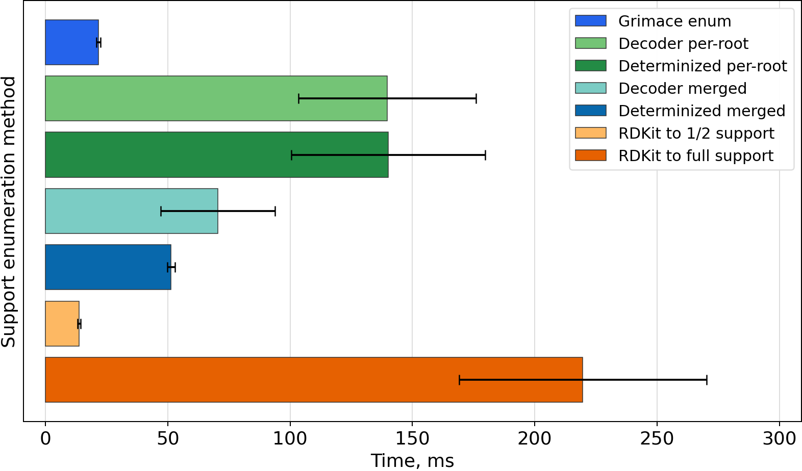
</figure>

<figure class="timing-plot">
  <figcaption><code>COc1ccc2cc([C@H](C)C(=O)O)ccc2c1</code>:</figcaption>
  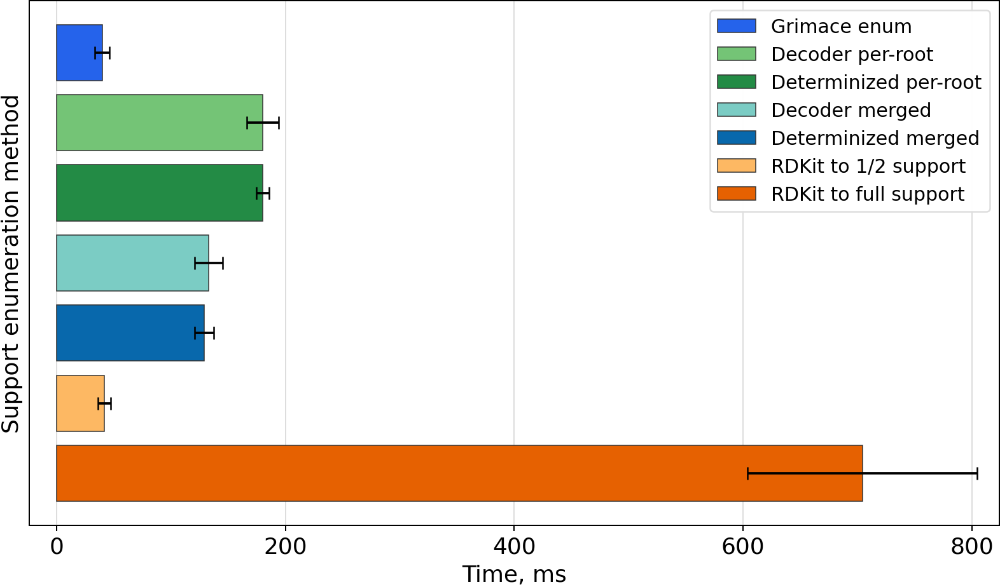
</figure>

<figure class="timing-plot">
  <figcaption><code>O=[N+]([O-])O[C@H]1CO[C@H]2[C@@H]1OC[C@H]2O[N+](=O)[O-]</code>:</figcaption>
  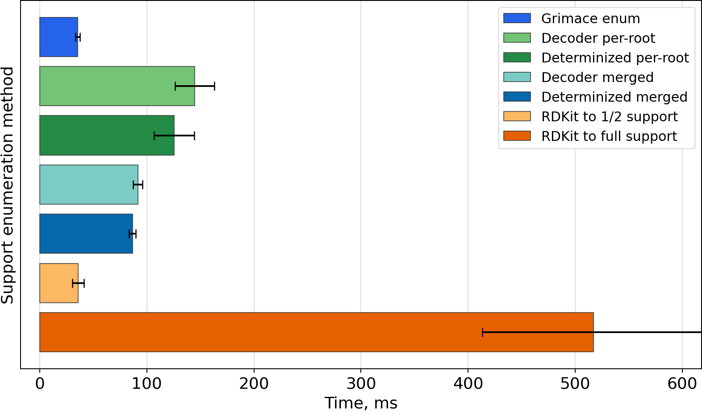
</figure>

<figure class="timing-plot">
  <figcaption><code>C=C1CC[C@H](O)C/C1=C/C=C1\CCC[C@]2(C)[C@@H]([CH]C)CC[C@@H]12</code>:</figcaption>
  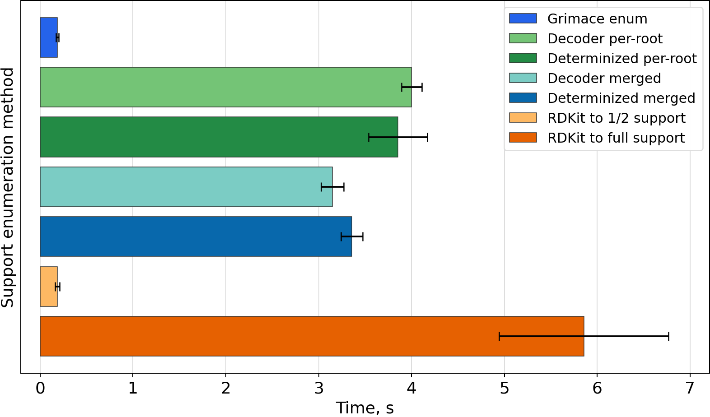
</figure>

<figure class="timing-plot">
  <figcaption><code>CC1=C(CC(=O)O)c2cc(F)ccc2/C1=C\c1ccc(S(C)=O)cc1</code>:</figcaption>
  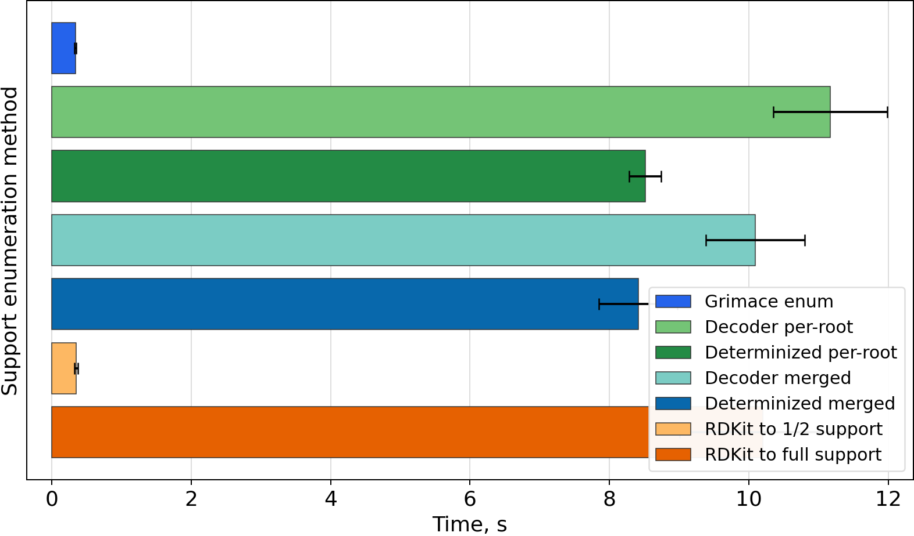
</figure>
