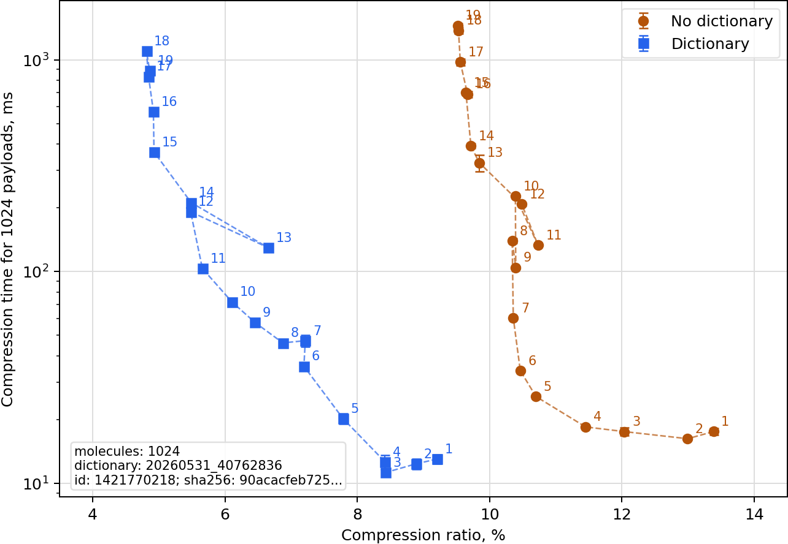
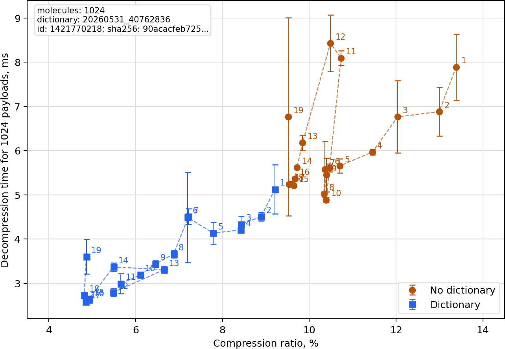
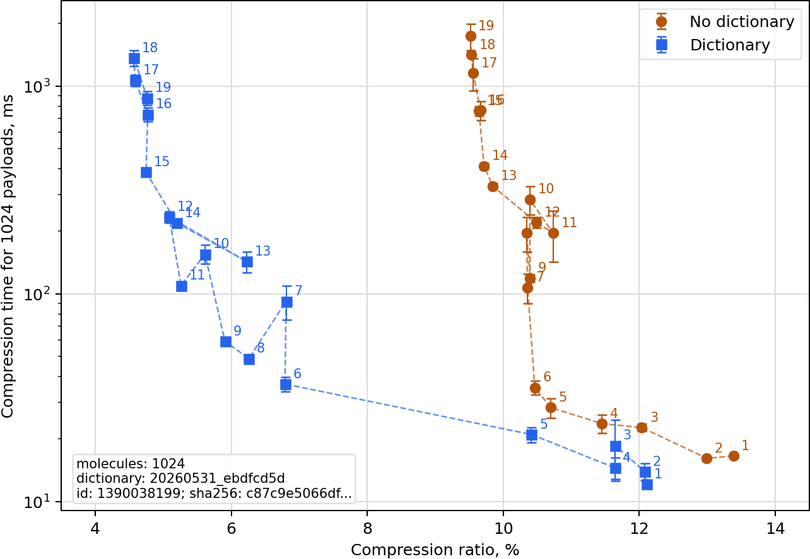
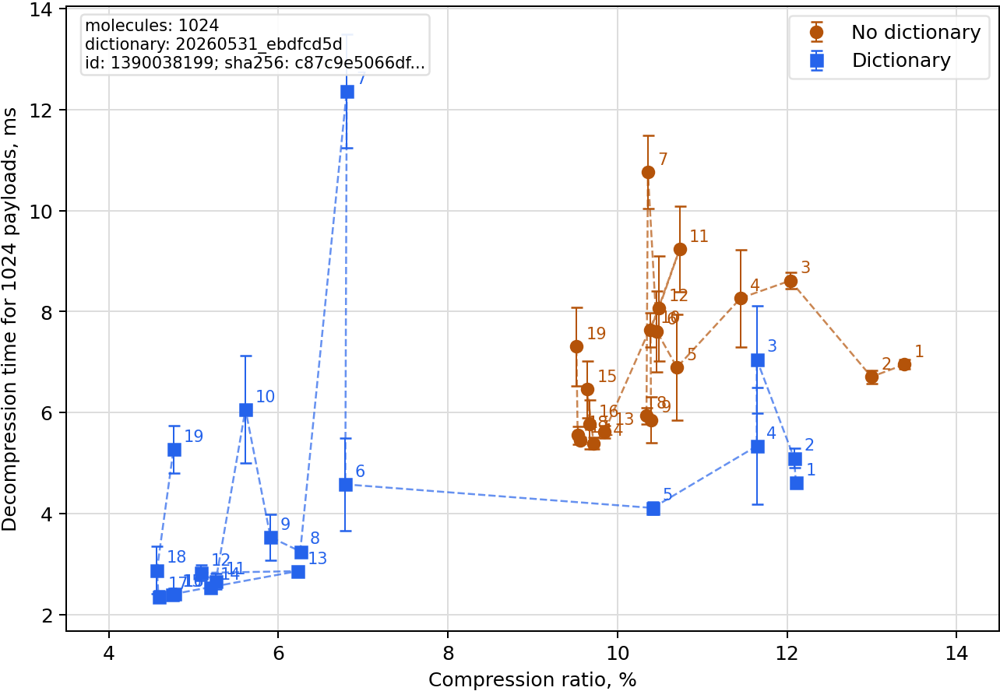

These timings measure optional zstd compression for serialized
`PreparedMol` payloads. Each benchmark compresses the same 1024 prepared
molecules at zstd levels 1 through 19, once without a dictionary and once with
a shipped PreparedMol dictionary.

Use these plots to choose a compression level for bulk storage. Lower
compression ratio is smaller output; lower time is faster. The benchmark is
indicative for this sample and machine, not a universal storage study.

## Benchmark setup

| Field | Value |
| --- | --- |
| Recorded | 2026-06-06 UTC |
| Runtime | Python 3.12.13, RDKit 2026.03.1, zstandard 0.25.0, zstd 1.5.7 |
| Platform | Linux-6.17.0-23-generic-x86_64-with-glibc2.36 |
| CPU | AMD Ryzen 5 7640U w/ Radeon 760M Graphics; 12 logical CPUs visible |
| Memory limit | 2 GiB |
| Container | `compose/timings-prepared-mol-zstd.yml` `timings-prepared-mol-zstd` service, network disabled |
| Sample | 1024 molecules, `random-parseable-preparable-v1`, seed `20260531` |
| Raw payload bytes | 5,742,205 |

| Training level | Dictionary artifact | Dictionary ID | Raw data |
| --- | --- | --- | --- |
| 3 | `20260531_40762836` | `1421770218` | [`docs/timings-prepared-mol-zstd.tsv`](timings-prepared-mol-zstd.tsv) |
| 10 | `20260531_ebdfcd5d` | `1390038199` | [`docs/timings-prepared-mol-zstd-20260531_ebdfcd5d.tsv`](timings-prepared-mol-zstd-20260531_ebdfcd5d.tsv) |

The plotted points are zstd levels. Error bars show standard deviation across
the timing repeats recorded in the TSV.

## Training level 3 dictionary

The smallest observed dictionary output in this run was about 4.8% of raw bytes
at compression level 18. At compression level 10 it was about 6.1%.

<figure class="timing-plot">
  <figcaption>Compression ratio versus compression time:</figcaption>
  
</figure>

<figure class="timing-plot">
  <figcaption>Compression ratio versus decompression time:</figcaption>
  
</figure>

## Training level 10 dictionary

The smallest observed dictionary output in this run was about 4.6% of raw bytes
at compression level 18. At compression level 10 it was about 5.6%.

<figure class="timing-plot">
  <figcaption>Compression ratio versus compression time:</figcaption>
  
</figure>

<figure class="timing-plot">
  <figcaption>Compression ratio versus decompression time:</figcaption>
  
</figure>
