This file is generated by `tests/perf/test_readme_timings.py`.
The benchmark first writes `docs/timings.tsv`, then renders this
Markdown page and timing plots from that TSV.

Example timings from the opt-in performance benchmark, measured in release mode
on one development machine. Treat them as indicative, not as a portability,
stability, or universality guarantee.

- This is a small curated benchmark: 9 molecules, 2 writer modes, and
  7 timing repeats per row.
- This is not a workload study and not an exact-versus-exact comparison.
- `Support`: the size of the exact rooted SMILES support across all root atoms.
- `Grimace enum (per-root union)`: union of
  `MolToSmilesEnum(..., rootedAtAtom=root_idx, canonical=False, doRandom=True, isomericSmiles=<table mode>)`
  over every root atom.
- The direct public `MolToSmilesEnum(..., rootedAtAtom=-1, ...)` path is
  not timed in this column and can differ materially from the explicit
  per-root union shown here.
- `Decoder enum (branch-preserving, per-root)`: exhaustive traversal of
  `MolToSmilesDecoder(..., rootedAtAtom=root_idx, canonical=False, doRandom=True, isomericSmiles=<table mode>).next_choices`
  over every root atom, then unioned.
- `Decoder enum (determinized, per-root)`: the same per-root traversal,
  using `MolToSmilesDeterminizedDecoder(...)`.
- `Decoder enum (branch-preserving, merged)`: exhaustive traversal of
  `MolToSmilesDecoder(..., rootedAtAtom=-1, canonical=False, doRandom=True, isomericSmiles=<table mode>).next_choices`.
- `Decoder enum (determinized, merged)`: the same merged traversal,
  using `MolToSmilesDeterminizedDecoder(...)`.
- `RDKit to 1/2 support`: repeated RDKit `MolToSmiles(..., canonical=False,
  doRandom=True, rootedAtAtom=root_idx, isomericSmiles=<table mode>)` draws
  across all roots until half of the exact support has been seen.
- `RDKit to full support`: the same sampling process until the full exact
  support has been seen.
- `Non-stereo` means `isomericSmiles=False`.
- `Stereo` means `isomericSmiles=True`.
- All timing columns are shown as `time mean ± std`.
- The two RDKit columns also show `(draw mean ± std)` over repeated seeded
  trials.
- The published table does not directly rank every public exact path:
  it times `Grimace enum (per-root union)` rather than the direct
  public `MolToSmilesEnum(..., rootedAtAtom=-1)` path, and some
  merged decoder rows are numerically lower than that per-root
  union column.
- The merged decoder rows expose the public all-roots decoder path directly,
  so they can diverge substantially from the explicit per-root rows.
- Read the RDKit comparison as 'faster on this benchmark against this
  sampling baseline', not as a general claim about every molecule or
  every SMILES-writing workload.
- The determinized decoder can reduce exhaustive decoder cost on some
  molecules, but direct exact enumeration is still faster on these cases.

## Non-stereo (`isomericSmiles=False`)

{: .timings-table}
| Molecule | Atoms | Support | Grimace enum (per-root union) | Decoder enum (branch-preserving, per-root) | Decoder enum (determinized, per-root) | Decoder enum (branch-preserving, merged) | Decoder enum (determinized, merged) | RDKit to 1/2 support | RDKit to full support |
| --- | ---: | ---: | ---: | ---: | ---: | ---: | ---: | --- | --- |
| `CC(=O)Oc1ccccc1C(=O)O` | 13 | 304 | **11.1** ± 1.0 ms | **20.0** ± 2.2 ms | **18.6** ± 2.0 ms | **8.5** ± 0.9 ms | **7.5** ± 0.3 ms | **4.2** ± 0.3 ms (229.6 ± 9.6 draws) | **56.6** ± 7.6 ms (3106.4 ± 402.2 draws) |
| `C1CC2(CCO1)CO2` | 8 | 36 | **3.7** ± 0.1 ms | **5.9** ± 0.9 ms | **5.3** ± 0.5 ms | **1.9** ± 0.1 ms | **1.3** ± 0.0 ms | **0.3** ± 0.0 ms (24.3 ± 3.6 draws) | **1.8** ± 0.5 ms (156.7 ± 46.0 draws) |
| `CN1CCC[C@H]1c1cccnc1` | 12 | 136 | **7.9** ± 1.1 ms | **11.9** ± 1.7 ms | **12.7** ± 1.3 ms | **4.0** ± 0.3 ms | **3.7** ± 0.1 ms | **1.8** ± 0.1 ms (97.3 ± 5.4 draws) | **15.9** ± 2.9 ms (861.1 ± 154.4 draws) |
| `CNC(=O)O/N=C(\C)SC` | 10 | 72 | **4.5** ± 0.1 ms | **6.6** ± 1.0 ms | **6.3** ± 0.2 ms | **2.0** ± 0.0 ms | **2.0** ± 0.1 ms | **0.6** ± 0.0 ms (48.9 ± 4.2 draws) | **5.5** ± 1.2 ms (454.6 ± 98.3 draws) |
| `N[C@@H](Cc1ccc(O)c(O)c1)C(=O)O` | 14 | 688 | **11.1** ± 0.7 ms | **30.0** ± 2.8 ms | **31.0** ± 3.8 ms | **15.5** ± 0.2 ms | **15.4** ± 1.1 ms | **10.7** ± 1.5 ms (514.6 ± 16.5 draws) | **154.1** ± 10.6 ms (8108.6 ± 547.3 draws) |
| `COc1ccc2cc([C@H](C)C(=O)O)ccc2c1` | 17 | 1504 | **18.6** ± 1.8 ms | **67.3** ± 4.8 ms | **71.0** ± 7.8 ms | **38.8** ± 2.4 ms | **38.3** ± 1.9 ms | **27.7** ± 1.4 ms (1162.3 ± 18.4 draws) | **502.6** ± 97.1 ms (20970.1 ± 4191.5 draws) |
| `O=[N+]([O-])O[C@H]1CO[C@H]2[C@@H]1OC[C@H]2O[N+](=O)[O-]` | 16 | 620 | **16.1** ± 1.6 ms | **56.4** ± 4.2 ms | **59.2** ± 8.0 ms | **30.4** ± 1.0 ms | **19.1** ± 1.0 ms | **9.2** ± 0.3 ms (485.9 ± 13.7 draws) | **161.2** ± 40.6 ms (8272.0 ± 2122.3 draws) |
| `C=C1CC[C@H](O)C/C1=C/C=C1\CCC[C@]2(C)[C@@H]([CH]C)CC[C@@H]12` | 22 | 5548 | **40.1** ± 2.3 ms | **316.6** ± 62.7 ms | **282.2** ± 64.4 ms | **155.4** ± 1.4 ms | **174.6** ± 11.7 ms | **164.0** ± 12.0 ms (4707.6 ± 69.3 draws) | **4379.2** ± 685.7 ms (129595.7 ± 17892.8 draws) |
| `CC1=C(CC(=O)O)c2cc(F)ccc2/C1=C\c1ccc(S(C)=O)cc1` | 25 | 12096 | **76.7** ± 2.0 ms | **1198.7** ± 154.3 ms | **917.3** ± 140.9 ms | **702.0** ± 79.7 ms | **374.9** ± 30.8 ms | **328.7** ± 6.1 ms (9541.7 ± 102.1 draws) | **11825.9** ± 2525.9 ms (311150.0 ± 67407.2 draws) |

<figure class="timing-plot">
  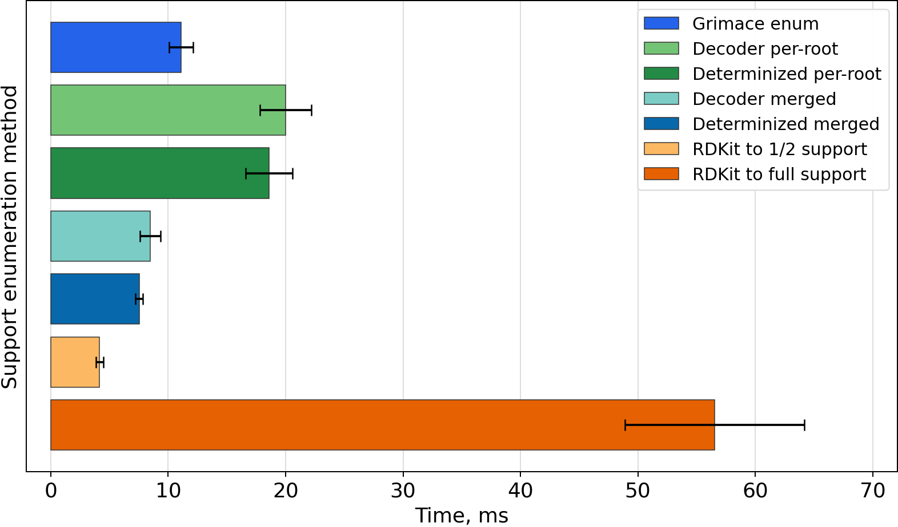
  <figcaption><code>CC(=O)Oc1ccccc1C(=O)O</code></figcaption>
</figure>

<figure class="timing-plot">
  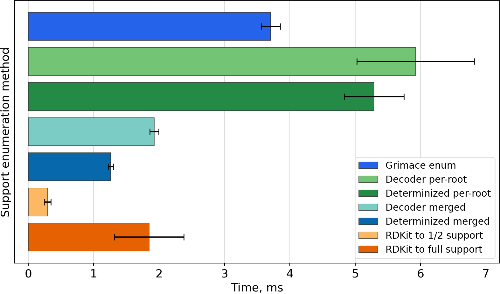
  <figcaption><code>C1CC2(CCO1)CO2</code></figcaption>
</figure>

<figure class="timing-plot">
  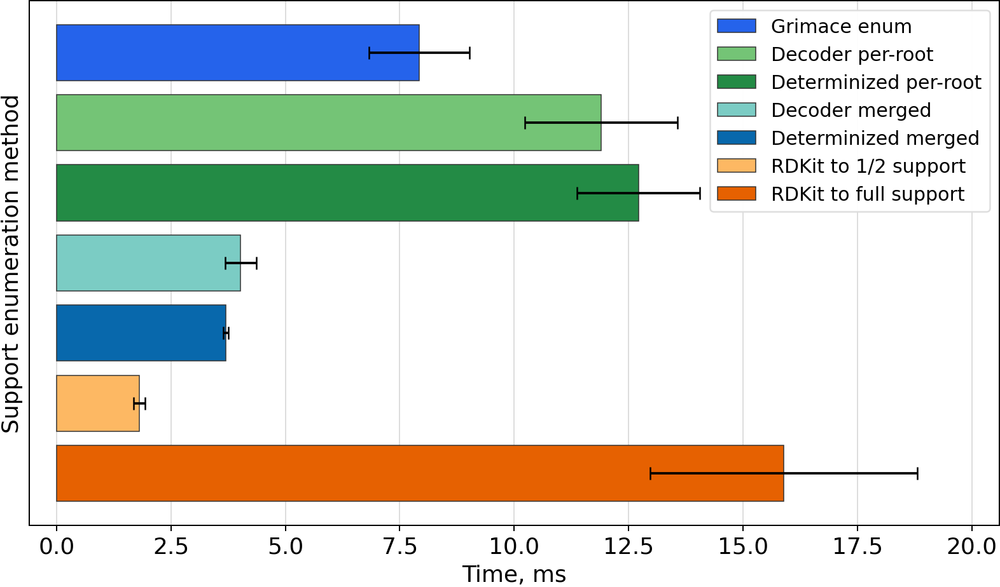
  <figcaption><code>CN1CCC[C@H]1c1cccnc1</code></figcaption>
</figure>

<figure class="timing-plot">
  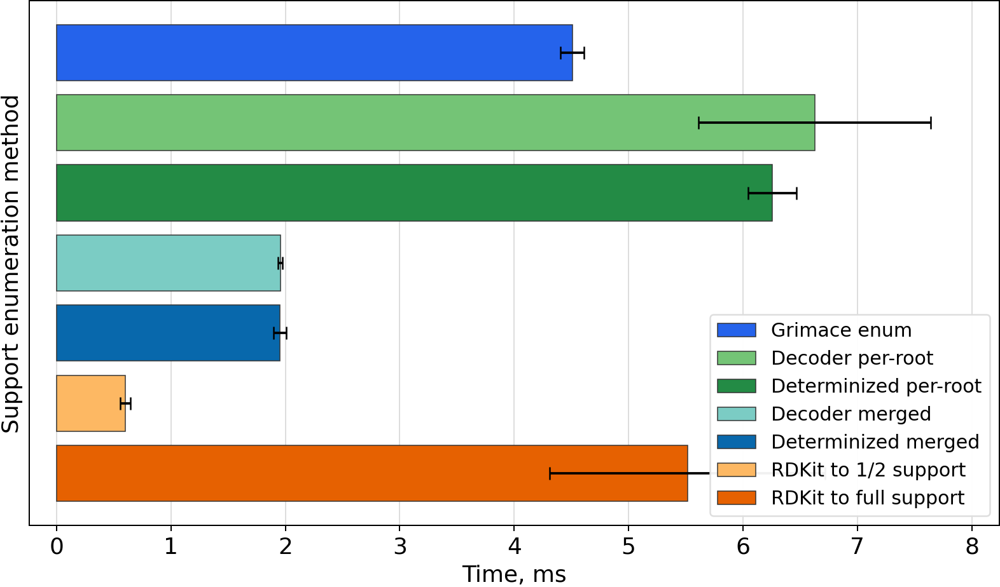
  <figcaption><code>CNC(=O)O/N=C(\C)SC</code></figcaption>
</figure>

<figure class="timing-plot">
  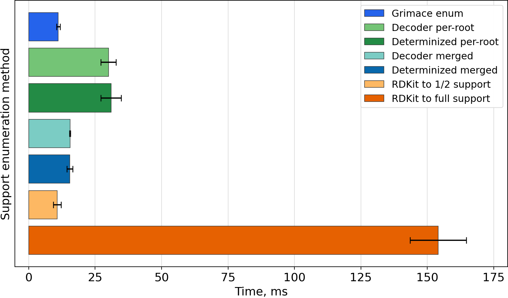
  <figcaption><code>N[C@@H](Cc1ccc(O)c(O)c1)C(=O)O</code></figcaption>
</figure>

<figure class="timing-plot">
  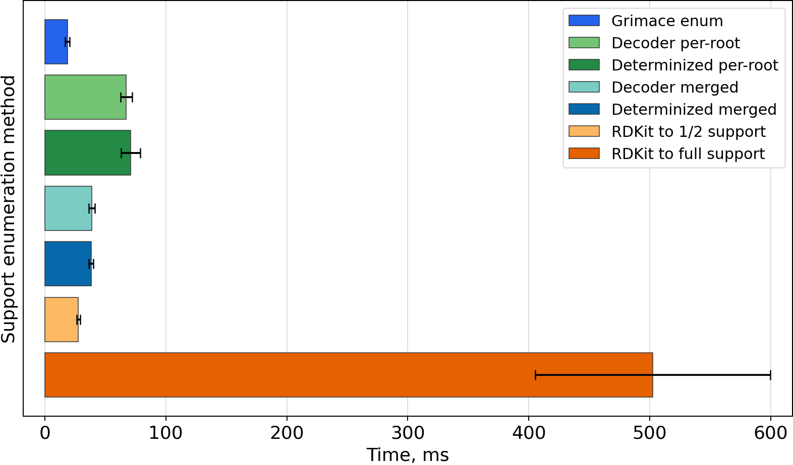
  <figcaption><code>COc1ccc2cc([C@H](C)C(=O)O)ccc2c1</code></figcaption>
</figure>

<figure class="timing-plot">
  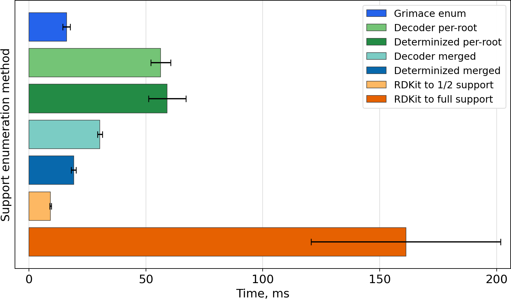
  <figcaption><code>O=[N+]([O-])O[C@H]1CO[C@H]2[C@@H]1OC[C@H]2O[N+](=O)[O-]</code></figcaption>
</figure>

<figure class="timing-plot">
  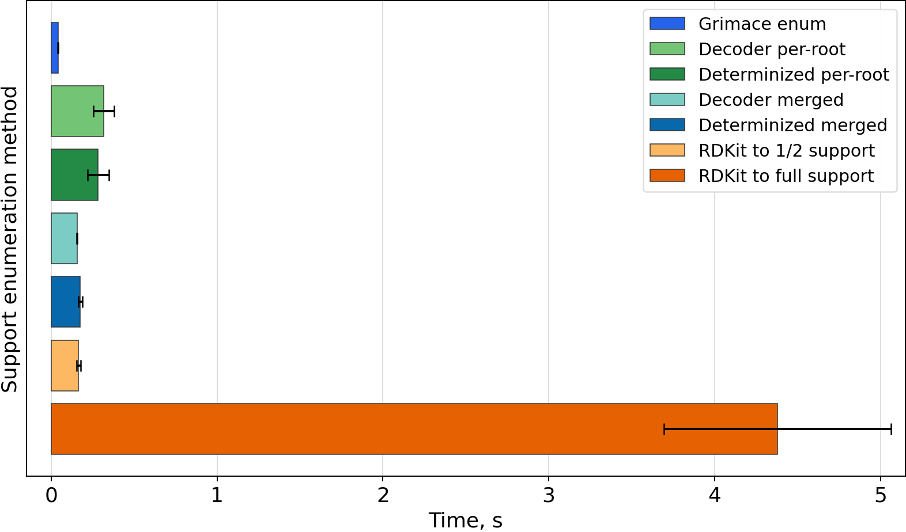
  <figcaption><code>C=C1CC[C@H](O)C/C1=C/C=C1\CCC[C@]2(C)[C@@H]([CH]C)CC[C@@H]12</code></figcaption>
</figure>

<figure class="timing-plot">
  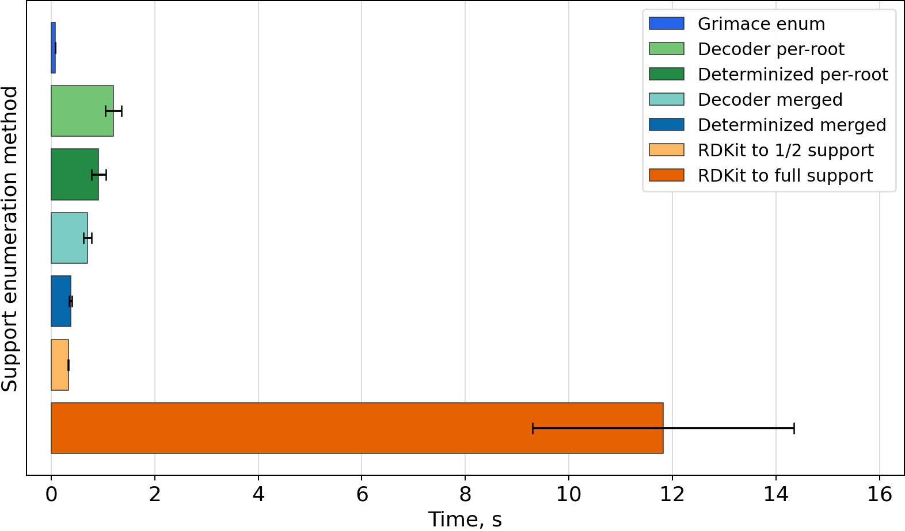
  <figcaption><code>CC1=C(CC(=O)O)c2cc(F)ccc2/C1=C\c1ccc(S(C)=O)cc1</code></figcaption>
</figure>

## Stereo (`isomericSmiles=True`)

{: .timings-table}
| Molecule | Atoms | Support | Grimace enum (per-root union) | Decoder enum (branch-preserving, per-root) | Decoder enum (determinized, per-root) | Decoder enum (branch-preserving, merged) | Decoder enum (determinized, merged) | RDKit to 1/2 support | RDKit to full support |
| --- | ---: | ---: | ---: | ---: | ---: | ---: | ---: | --- | --- |
| `CC(=O)Oc1ccccc1C(=O)O` | 13 | 304 | **15.0** ± 1.4 ms | **26.9** ± 1.7 ms | **22.9** ± 0.7 ms | **11.9** ± 0.3 ms | **10.0** ± 0.3 ms | **4.4** ± 0.1 ms (217.9 ± 5.3 draws) | **50.9** ± 10.3 ms (2466.9 ± 539.3 draws) |
| `C1CC2(CCO1)CO2` | 8 | 36 | **6.3** ± 0.3 ms | **8.1** ± 0.1 ms | **7.3** ± 0.0 ms | **3.1** ± 0.0 ms | **2.4** ± 0.1 ms | **0.3** ± 0.1 ms (22.7 ± 2.6 draws) | **2.3** ± 0.6 ms (178.0 ± 40.0 draws) |
| `CN1CCC[C@H]1c1cccnc1` | 12 | 136 | **11.9** ± 0.4 ms | **16.6** ± 0.3 ms | **16.5** ± 0.4 ms | **6.4** ± 0.3 ms | **6.1** ± 0.3 ms | **2.0** ± 0.1 ms (93.1 ± 6.3 draws) | **18.3** ± 5.5 ms (877.9 ± 271.1 draws) |
| `CNC(=O)O/N=C(\C)SC` | 10 | 72 | **8.0** ± 0.2 ms | **19.1** ± 0.8 ms | **18.6** ± 1.6 ms | **11.9** ± 0.2 ms | **11.1** ± 0.1 ms | **0.7** ± 0.1 ms (50.1 ± 6.7 draws) | **5.6** ± 1.3 ms (416.4 ± 96.6 draws) |
| `N[C@@H](Cc1ccc(O)c(O)c1)C(=O)O` | 14 | 688 | **16.0** ± 0.1 ms | **39.4** ± 1.9 ms | **36.2** ± 1.4 ms | **23.0** ± 0.2 ms | **20.0** ± 0.3 ms | **10.9** ± 0.5 ms (521.1 ± 22.0 draws) | **174.4** ± 56.8 ms (8194.6 ± 2525.9 draws) |
| `COc1ccc2cc([C@H](C)C(=O)O)ccc2c1` | 17 | 1504 | **26.1** ± 0.4 ms | **91.0** ± 4.6 ms | **89.0** ± 14.8 ms | **58.6** ± 2.6 ms | **51.1** ± 1.1 ms | **32.5** ± 1.5 ms (1139.4 ± 30.2 draws) | **573.3** ± 88.8 ms (19420.1 ± 3609.7 draws) |
| `O=[N+]([O-])O[C@H]1CO[C@H]2[C@@H]1OC[C@H]2O[N+](=O)[O-]` | 16 | 1240 | **23.9** ± 1.1 ms | **70.2** ± 5.9 ms | **66.5** ± 3.5 ms | **43.9** ± 1.6 ms | **40.0** ± 1.9 ms | **21.7** ± 0.5 ms (984.4 ± 18.8 draws) | **384.7** ± 26.0 ms (16631.3 ± 1082.0 draws) |
| `C=C1CC[C@H](O)C/C1=C/C=C1\CCC[C@]2(C)[C@@H]([CH]C)CC[C@@H]12` | 22 | 5548 | **156.8** ± 4.3 ms | **1807.7** ± 54.9 ms | **1920.0** ± 298.2 ms | **1507.1** ± 29.8 ms | **1494.9** ± 77.5 ms | **159.2** ± 5.0 ms (4702.4 ± 31.1 draws) | **4485.1** ± 629.6 ms (126625.9 ± 18285.0 draws) |
| `CC1=C(CC(=O)O)c2cc(F)ccc2/C1=C\c1ccc(S(C)=O)cc1` | 25 | 12096 | **363.6** ± 17.3 ms | **5598.4** ± 103.0 ms | **4643.6** ± 457.8 ms | **4504.4** ± 193.7 ms | **3448.7** ± 69.7 ms | **337.5** ± 5.8 ms (9556.3 ± 55.7 draws) | **9734.5** ± 1283.7 ms (260894.1 ± 28940.6 draws) |

<figure class="timing-plot">
  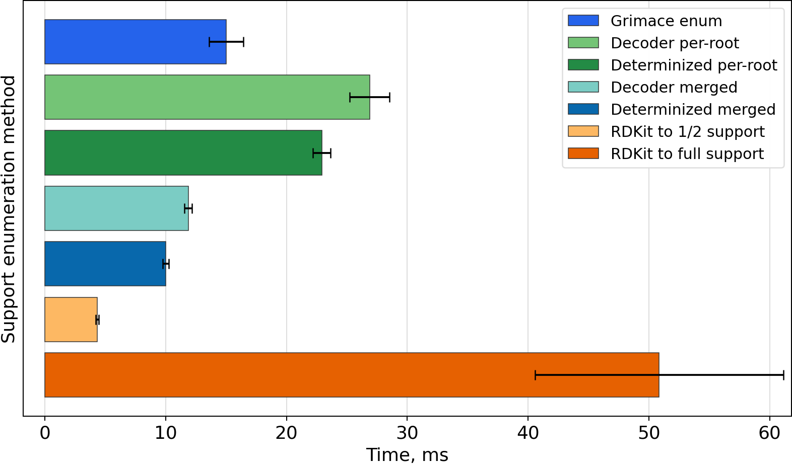
  <figcaption><code>CC(=O)Oc1ccccc1C(=O)O</code></figcaption>
</figure>

<figure class="timing-plot">
  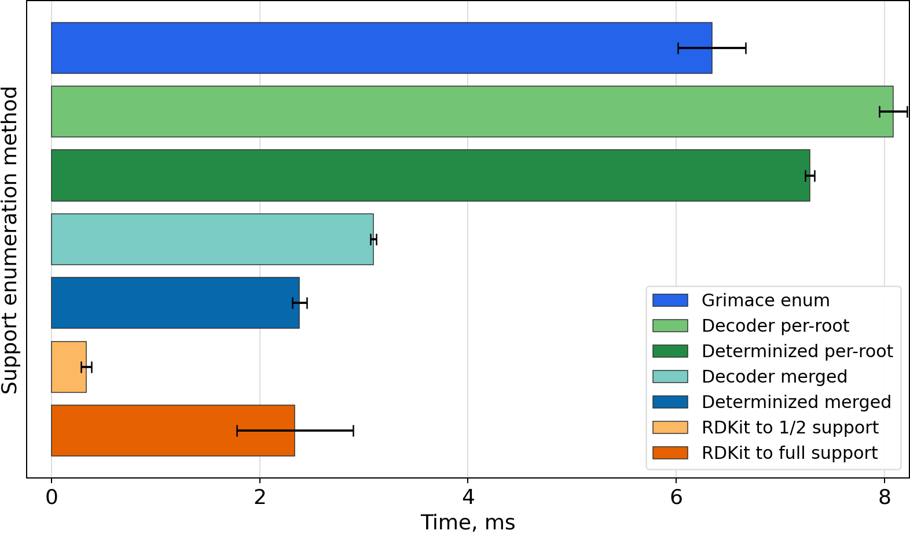
  <figcaption><code>C1CC2(CCO1)CO2</code></figcaption>
</figure>

<figure class="timing-plot">
  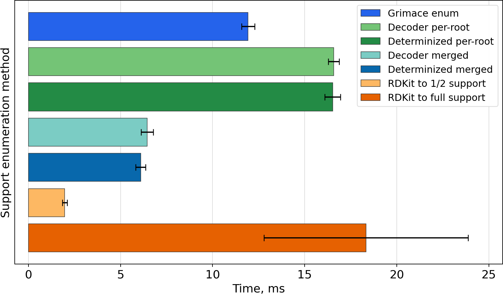
  <figcaption><code>CN1CCC[C@H]1c1cccnc1</code></figcaption>
</figure>

<figure class="timing-plot">
  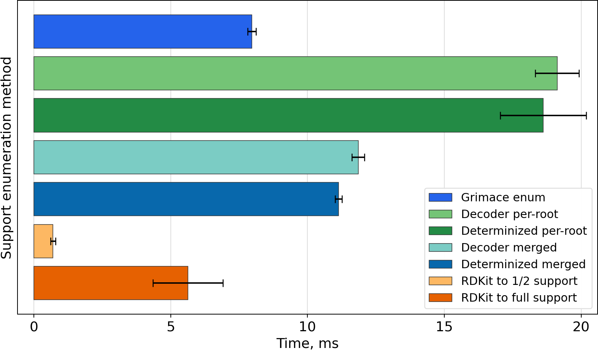
  <figcaption><code>CNC(=O)O/N=C(\C)SC</code></figcaption>
</figure>

<figure class="timing-plot">
  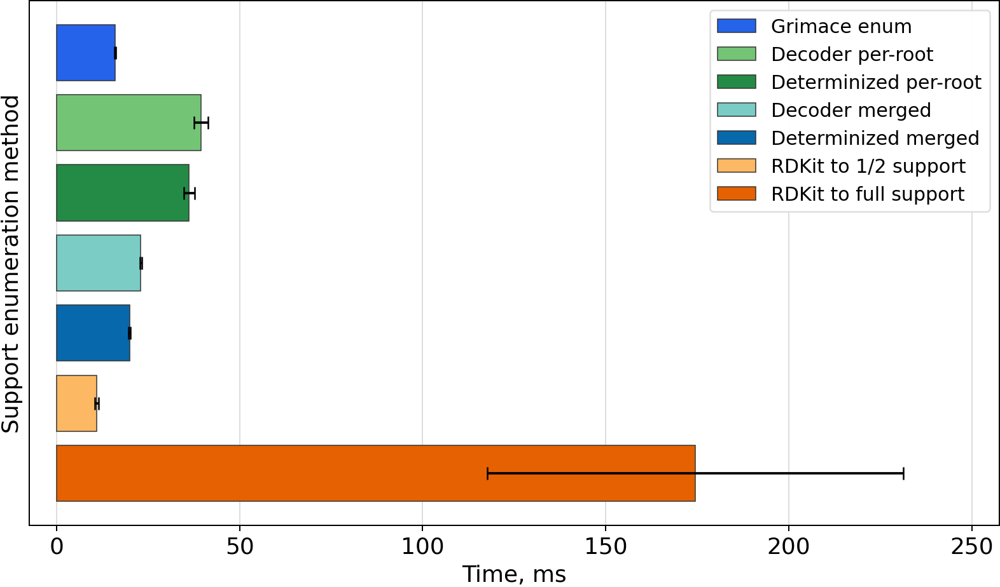
  <figcaption><code>N[C@@H](Cc1ccc(O)c(O)c1)C(=O)O</code></figcaption>
</figure>

<figure class="timing-plot">
  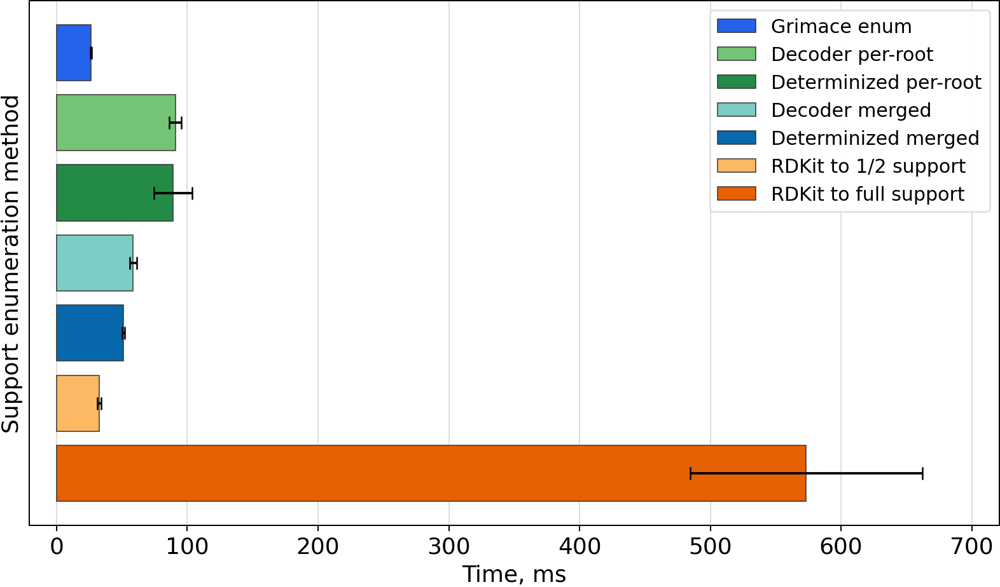
  <figcaption><code>COc1ccc2cc([C@H](C)C(=O)O)ccc2c1</code></figcaption>
</figure>

<figure class="timing-plot">
  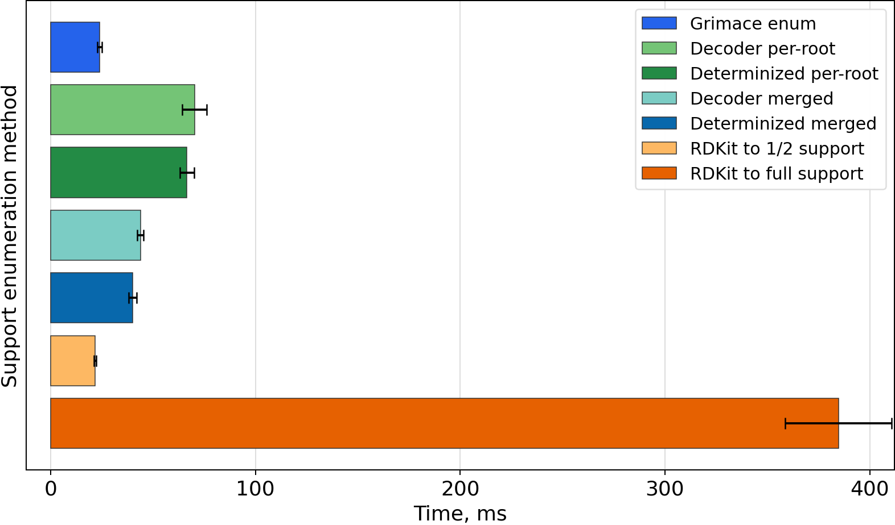
  <figcaption><code>O=[N+]([O-])O[C@H]1CO[C@H]2[C@@H]1OC[C@H]2O[N+](=O)[O-]</code></figcaption>
</figure>

<figure class="timing-plot">
  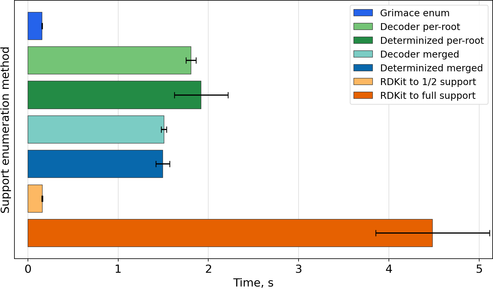
  <figcaption><code>C=C1CC[C@H](O)C/C1=C/C=C1\CCC[C@]2(C)[C@@H]([CH]C)CC[C@@H]12</code></figcaption>
</figure>

<figure class="timing-plot">
  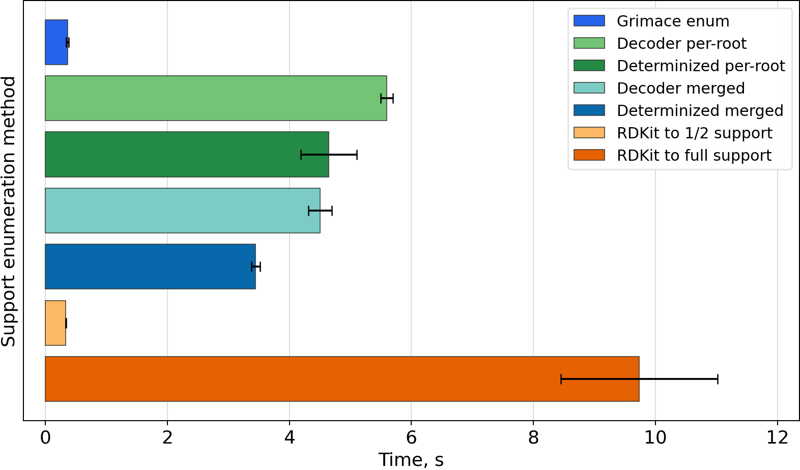
  <figcaption><code>CC1=C(CC(=O)O)c2cc(F)ccc2/C1=C\c1ccc(S(C)=O)cc1</code></figcaption>
</figure>
